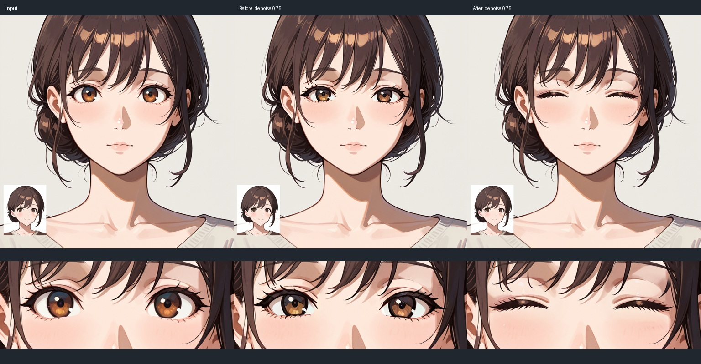
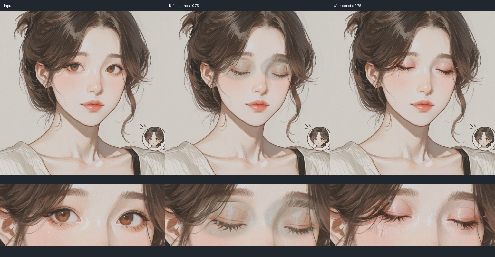

# Illustrious 인페인팅 대조 및 수정 · 0.2.3

## 결과

- **WAI v16 + painterly 0.55 + Reze 0.35**: 같은 원본·선택 마스크·시드·프롬프트·변형 강도 0.75로 비교. 기존 방식은 눈이 열린 채였고, 수정 방식은 눈을 감았습니다.
- **Zeniji v1 + painterly 0.55**: 이 조합으로 얼굴을 새로 생성한 뒤 같은 모델 조합으로 전후 비교했습니다. 기존 결과의 눈꺼풀 주변 거친 명암과 회색 패치가 수정본에서 줄었습니다. 머리카락과 겹치는 선택 부위의 선이 변할 수 있습니다.
- WAI 원본에 Zeniji를 적용하는 별도 교차 모델 테스트에서는 원본과 색감 차이가 남았습니다. 한 모델의 결과를 다른 모델로 수정할 때 동일한 스타일을 보장하지 않습니다.
- 보고된 **피부 비늘** 자체는 제공된 실제 재현 이미지가 없어 확정 재현하지 못했습니다. 이 릴리스를 그 증상의 완전 해결로 표시하지 않습니다.

## 근거와 적용

[Illustrious 지원 Krita AI Diffusion 구현](https://github.com/Acly/krita-ai-diffusion/blob/main/ai_diffusion/backend/workflow.py)은 일반 모델 경로에서 VAEEncode + SetLatentNoiseMask에 Differential Diffusion, 영역 처리, 원본 색감 보정을 결합합니다. Fooocus 패치는 SDXL 전용 분기에 있으며 Illustrious에 무조건 적용하는 구성이 아닙니다. 구현 코드는 복사하지 않고 기존 ComfyUI 노드로 구성했습니다.

[EasyIllustrious의 안내](https://github.com/regiellis/ComfyUI-EasyIllustrious/blob/main/web/docs/guides/inpainting_and_regional.md)와 [VAE 구현](https://github.com/regiellis/ComfyUI-EasyIllustrious/blob/main/src/nodes/vae.py)도 일반 이미지 인코딩과 부드러운 노이즈 마스크를 지원합니다. InpaintModelConditioning을 추가하는 것만으로 일반 체크포인트가 전용 인페인팅 모델이 되는 것은 아닙니다.

우리 수정: 싱크한 마스크의 모든 0보다 큰 픽셀 경계 측정 → 주변 맥락 160px 이상 포함 → 긴 변 1024px로 확대/축소 → VAEEncode + 부드러운 noise mask + Differential Diffusion → decode → KJ ColorMatch(mkl) → 원본 크기·좌표로 되돌려 마스크 합성. 확장과 흐림은 원본 픽셀 단위를 유지합니다. 라인아트와 뎁스·포즈용 참조도 같은 작업 영역에 맞추며, 스타일 참조와 모델/LoRA 선택은 유지합니다.

Zeniji의 VAE 왕복만 실행한 결과에서도 대비·색감 저하가 관찰돼 색감 보정을 비교했습니다. 모델 손상이나 사용자 비늘 현상의 원인이라고 확정하지 않습니다. 색감 보정이 있는 최종 그래프에서 같은 얼굴의 회색 패치가 줄었음을 시각적으로 확인했습니다.

## 검증 범위

- Comfy Desktop minimax, 기존 서버 8189, RTX 3090. 서버/열린 미저장 워크플로우를 재시작하거나 교체하지 않았습니다.
- 이번 추가 실행 13회: 얼굴 생성 1, VAE 왕복 1, 인페인팅 비교 11. 최종 Zeniji 검사는 플러그인의 makePrompt 함수가 생성한 전체 그래프를 직접 실행했습니다.
- 11개 합성 결과 모두 1024×1024. 원래 마스크에 50px 보호 여유를 더한 영역 밖 픽셀 차이 0. 이 검사가 흐림 경계 안의 모든 픽셀을 원본과 동일하게 보장하는 뜻은 아닙니다.
- JavaScript 32개, 설치기 14개 검사 통과. 홀수 크기·작은 캔버스·가장자리 선택의 좌표 범위, feather 픽셀, LoRA 체인, 제어 이미지 연결, 일반 생성 경로 유지 포함.
- 뎁스·포즈·스타일과 인페인팅을 모두 켠 GPU 이미지 품질 및 Photoshop에서 싱크→생성→적용하는 최신 전체 UI 경로는 이번 수정에서 재검수하지 않았습니다.
- 추가 모델·커스텀 노드 설치 없음. ComfyUI 기본 노드 및 기존 설치기의 KJNodes ColorMatch 사용. 설치기가 고정한 KJNodes 커밋의 클래스/입력 호환도 확인했습니다.

## 사용

0.2.2 사용자는 연결 설정 → 업데이트 확인으로 0.2.3 CCX를 받아 Adobe 설치를 완료합니다. 패널을 다시 열고 **선택 영역을 다시 싱크**하세요. 기존 모델·연결 설정을 초기화하지 않습니다. 실제 처리 그래프는 결과의 워크플로우 저장 버튼으로 확인할 수 있습니다.

## 실행 이력

- baseline-zeniji-native: 18.14초, `b9cf702f-d7f5-46c6-a5af-a0de7f5877cc`
- crop-full: 18.12초, `25a81ac4-d046-43d9-8c17-fbe9611e2a54`
- crop: 18.28초, `3bcae4d4-cd8f-4897-a10b-b657dc3e37a4`
- differential: 32.63초, `d9f060e3-c779-4fad-bbdc-7ce6059d7866`
- production-color: 26.70초, `741ba73b-0203-40c4-a35e-d63ff4232941`
- production-final-zeniji-native: 26.16초, `014985ea-198e-4e74-a855-09afb0b932f4`
- production: 18.11초, `9a956980-ef13-449e-a4ec-eb7cc41edf7c`
- production-zeniji-low: 18.14초, `0dede4c5-7c4c-4d89-a832-f92ab7ee95f2`
- production-zeniji-native-color: 18.11초, `73ce985d-bd19-412a-b8c9-c4f1817458e3`
- production-zeniji-native: 18.11초, `da4e80b4-ab1e-42c2-8300-e6ae123fdf40`
- production-zeniji: 24.76초, `a99d5613-8912-439f-ae7a-8c17c744a78e`
- zeniji-base: 18.13초, `28156bdf-8bfc-40e4-ba80-8b458810b0fc`
- zeniji-native-vaecheck: 4.05초, `5c51ca15-6ca0-4037-9a02-387fa14d7747`
